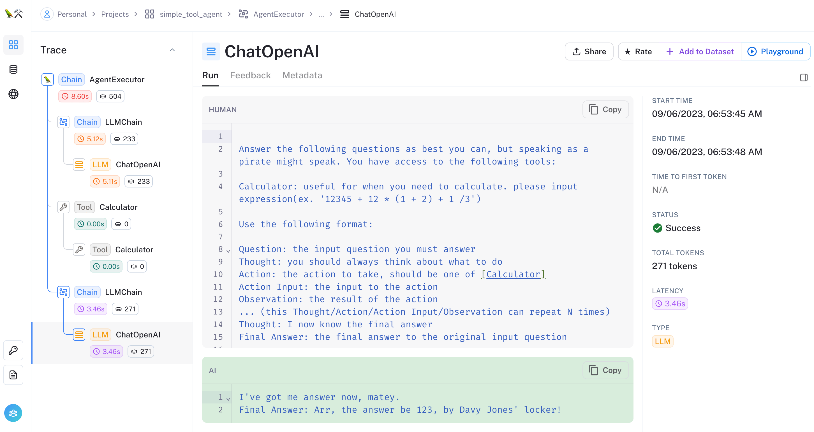
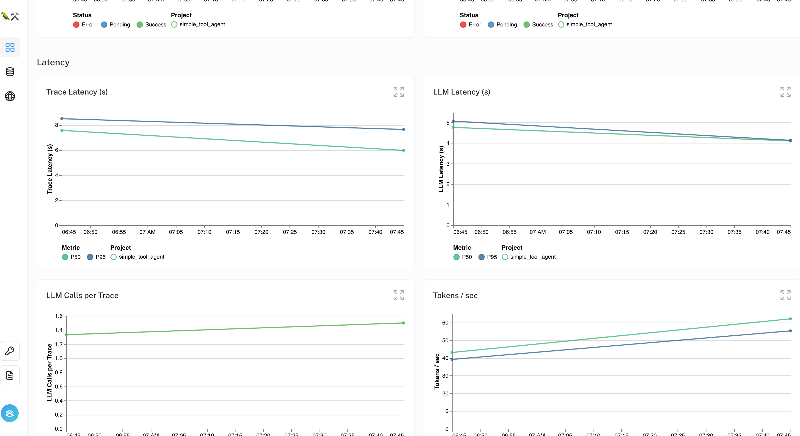
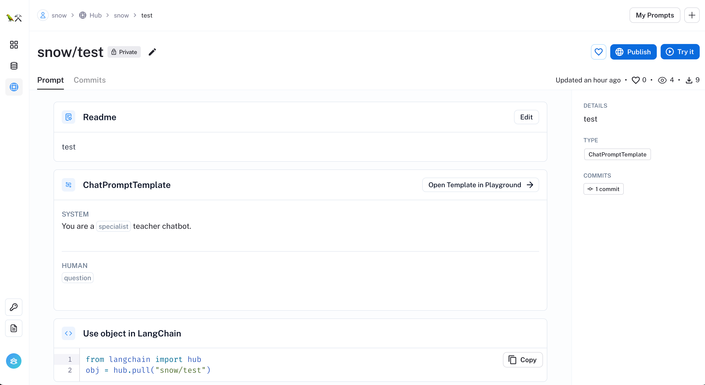

# LangSmithの紹介

ndruger

---

# LangSmithとは？

- LangChainを使ったサービスのメトリクスを取得し、デバッグ・評価などを行うことが出来るクラウドサービス。
- プロンプトのバージョン管理・共有・試行なども出来る。
- 2023/9/6の時点で、クローズドベータでありウェイトリストに登録する必要がある。

---

# LLMを利用したプロジェクトの課題

- サービスのレスポンスタイムが問題になることが多く、ボトルネックを発見するために、継続的なメトリクス取得による改善をしていく必要がある。
  - LangChainのModel/Chain/Agentなどが複雑に動作する中で、それぞれの細かなフェーズ(ツールによる外部リクエストやOpenAI APIへのリクエストなど)ごとの処理時間を手間なく把握したい。
- LLMの出力を改善するために、ユーザーの入力に対する継続的な評価をして、プロンプトを修正していく必要がある。
  - ユーザーの入力に対する出力を記録し、それを元に評価し、プロンプトを修正し、データセットで改善を確認するというサイクルを手間なく繰り返したい。
  - プロンプトのバージョン管理・試行を手間なく行いたい。
  - サービスのユーザーの入力をデータセットとして利用したい。

---

# 自作すると相当な時間がかかる

- ロギングは結構手間がかかる。
  - 取得するべき情報が多くて洗い出しやログフォーマット決めが手間。
  - 全てのModel/Chain/Agentに設定するのが手間。
- ビジュアライズも手間がかかる。
  - AWSだとCloudWatch Logsにログを出して、QuickSightなどで可視化するのが手間
  - LangChainのコールグラフとして各処理の時間を見たければ独自に対応する必要がある。
- ログからデータセットの作成も手間がかかる。
  - AWSだとCloudWatch Logsにログを出して、必要な物を上手く切り出してデータセットを作成するのが手間。
- プロンプトをバージョン管理して手軽に試せる管理画面を作るのは手間がかかる。

---

# LangSmithの導入は非常に楽

- 参考: [LangSmith \| 🦜️🛠️ LangSmith](https://docs.smith.langchain.com/#quick-start)
- LangSmithのSDKライブラリはLangChainの依存関係に含まれているので別途インストールする必要はない。
- 環境変数を設定すると全てのModel/Chain/Agentに自動で適用される。

---

# LangSmithのダッシュボードでのデータ視覚化

- コールグラフとして各処理の時間を見ることが出来るので、ボトルネックが非常に分かりやすい。
  - パラメーター(モデル名等)や実行環境(LangChainのバージョン等)やトークン数も確認できる。
- 時系列グラフとしてレイテンシやトークン数のメトリクスの変化を見ることが出来る。
  - グラフの対象を特定のChainに限定することはできない。現状非常に激しく機能追加がされているので今後に期待。

---



---



---

# 取得したデータからデータセットの作成

LangSmithで取得したデータはクラウドに保存されているので、そのデータの中から必要な物を選んで取得したりデータセットを作成することが出来る。[Datasets \| 🦜️🛠️ LangSmith](https://docs.smith.langchain.com/evaluation/datasets#create-from-existing-runs)

```python
from langsmith import Client

client = Client()
dataset_name = "Example Dataset"

# Filter runs to add to the dataset
runs = client.list_runs(
    project_name="my_project",
    execution_order=1,
    error=False,
)

dataset = client.create_dataset(dataset_name, description="An example dataset")
for run in runs:
    client.create_example(
        inputs=run.inputs,
        outputs=run.outputs,
        dataset_id=dataset.id,
    )
```

---

# Hub

- プロンプトを探したり・共有したり・バージョンコントロールするための機能。
- サービス用の共有しないプライベートのプロンプトも管理できる。
- 一部の機能はLangSmithにログインせずに利用できる。
- Playgroundでブラウザ上でプロンプトの動作確認が出来る。
- コードからHubに登録したプロンプトを取得して利用できる。

---



---

# コードからHubに登録したプロンプトを取得して利用する

```python
from langchain import hub, LLMChain
from langchain.chat_models import ChatOpenAI

prompt = hub.pull("snow/test")  # Hubからプロンプトを取得。snow/test:d027e2f2 のようにハッシュでバージョンも指定できる。

llm = ChatOpenAI(model_name="gpt-3.5-turbo", max_tokens=50, temperature=0.1)

llm_chain = LLMChain(llm=llm, prompt=prompt)
res = llm_chain(
    {"specialist": "programming", "question": "please explain elixir"},
    return_only_outputs=True,
)

print(res)
```

---

# LangSmithはどうやってデータを取得しているのか？(1)

- LangChainのChainの実行時の情報はコールバック関数を設定することで取得できる。
  - 参考: [Callbacks \| 🦜️🔗 Langchain](https://python.langchain.com/docs/modules/callbacks/)
- LangSmith用の環境変数を設定すると、これらのコールバックを利用した`LangChainTracer`が自動的に適用され、`LangChainTracer`がLangSmithの`Client`に各コールバックのデータを渡すようになっている。
  - https://github.com/langchain-ai/langchain/blob/master/libs/langchain/langchain/callbacks/tracers/langchain.py

---

# LangSmithはどうやってデータを取得しているのか？(2)

- LangSmithの`Client`にてLangSmithのサーバーにデータをアップロードしている。
  - https://github.com/langchain-ai/langsmith-sdk/blob/main/python/langsmith/client.py
- Python版のSDKでは、ログのアップロードによるパフォーマンスの悪化を避けるために、アップロードは非同期で行われる。AWSのLambdaで実行する場合は、エントリポイントのLambdaハンドラが終了する前に`wait_for_all_tracers()`を呼び出す必要がある。
  - https://docs.smith.langchain.com/tracing/tracing-faq#how-do-i-ensure-logging-is-completed-before-exiting-my-application

---

# LangSmithが取得しているデータを確認する

- `LangChainTracer`がLangSmithの`Client`の`create_run`と`update_run`を呼び出してコールバックで得た情報を渡しているので、引数を`print()`すると出すとどのようなデータをアップロードしているのか確認できる。
- 確認用コード
  - https://github.com/ndruger/presentations/blob/master/langsmith/check_langsmith_client_input.py
- 出力結果
  - https://github.com/ndruger/presentations/blob/master/langsmith/langsmith_log_create_run.json
  - https://github.com/ndruger/presentations/blob/master/langsmith/langsmith_log_update_run.json

---

# 最後に

- 専門ツールだけあって非常に手軽にLLMを使ったサービス開発で必要な情報の取得・管理が出来る。同レベルの物を自作するのは非常にコストと時間がかかる。
- 今回紹介した機能は一部で、LangSmithには他にも様々な機能がある。公式ドキュメントやCookbookを参照。
  - [LangSmith \| 🦜️🛠️ LangSmith](https://docs.smith.langchain.com/)
  - [langchain\-ai/langsmith\-cookbook](https://github.com/langchain-ai/langsmith-cookbook)

---

# 補足1: AWSでの速度計測

- AWSの場合、サービスの外部リクエストの速度計測や可視化にはX-Ray([AWS X\-Ray concepts \- AWS X\-Ray](https://docs.aws.amazon.com/xray/latest/devguide/xray-concepts.html)が便利。
  - クライアントはX-Ray SDKが使えるが、LambdaからはPowertools for AWS LambdaのTracerから使うこともできる。
    - 対応ライブラリによるDBや外部へのリクエストを自動でトレースしてレスポンスタイムを取得できる。
  - AWS Consoleにて結果をコールグラフで可視化できる。
  - 参考: [AWS X\-Ray SDK for Python \(beta\) で色々とトラッキングしてみる \| DevelopersIO](https://dev.classmethod.jp/articles/aws-x-ray-sdk-for-python-beta-implementation/)
